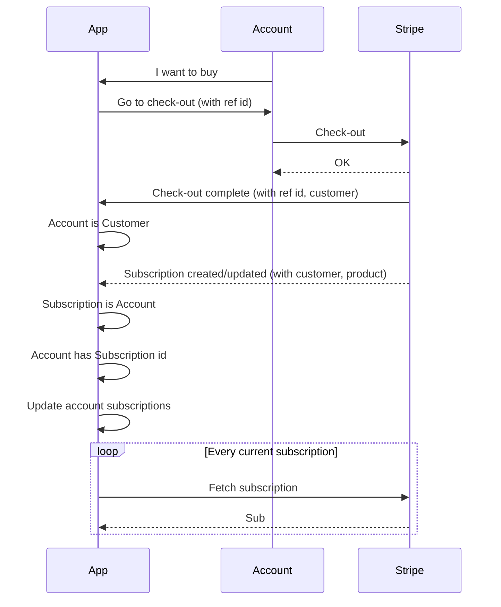

```mermaid
sequenceDiagram
    
    participant App
    participant Account
    participant Stripe
    Account->>App: I want to buy
    App->>Account: Go to check-out (with ref id)
    Account->>Stripe: Check-out
    Stripe-->>Account: OK
    Stripe->>App: Check-out complete (with ref id, customer)
    App->>App: Account is Customer
    Stripe-->>App: Subscription created/updated (with customer, product)
    App->>App: Subscription is Account
    App->>App: Account has Subscription id
    App->>App: Update account subscriptions
    loop Every current subscription
        App->>Stripe: Fetch subscription
        Stripe-->>App: Sub
    end

```
