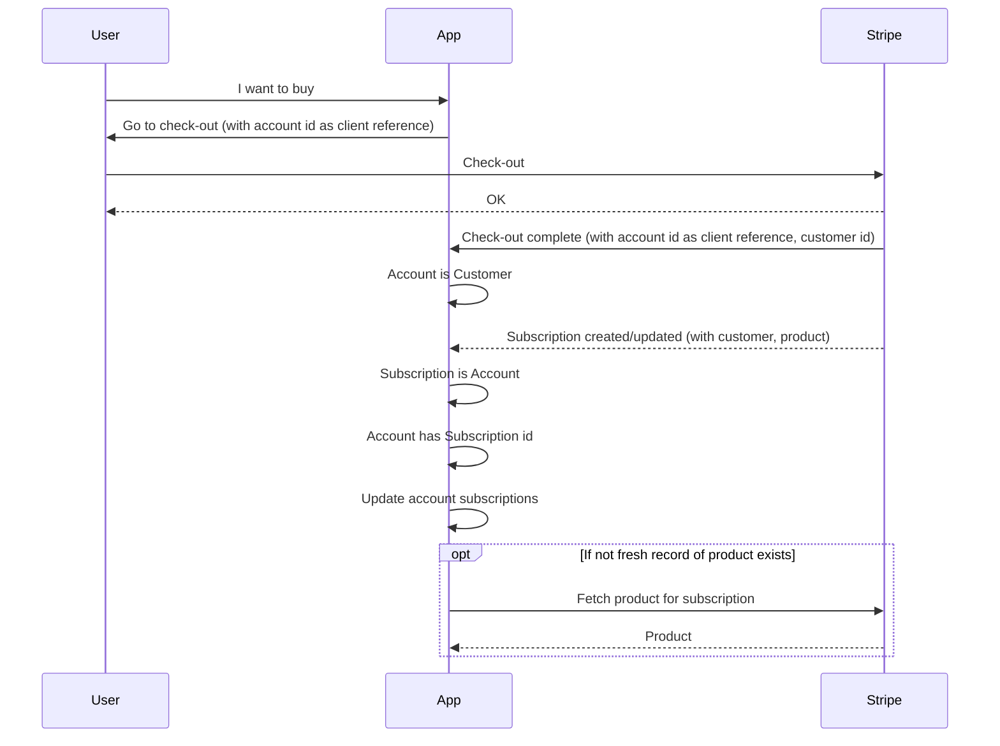

[](https://github.com/goofballLogic/firebase-stripe/actions/workflows/firebase-hosting-merge.yml)

# Firebase-stripe integration

The integration works by listening for `checkout.session.completed` events via a webhook which Stripe calls. This event (and only this event) contains a mapping of `customer` (customer id) to `client_reference_id`. 

The integration does not assume a 1-2-1 mapping between login email and the email used during Stripe checkout. Instead, Stripe subscriptions are associated with an "account" (which you can define as 1-2-1 (single user) or 1-2-n (team of users)).

**For the integration to work, you must make sure that the client_reference_id of your checkout event is account id for the resulting subscription**.

One way to accomplish this is to configure the "no-code" Stripe pricing table web component's `client-reference-id` attribute with the account id:
```html
<script async src="https://js.stripe.com/v3/pricing-table.js"></script>
<stripe-pricing-table pricing-table-id="prctbl_1M2dY . . .75R" publishable-key="pk_test_51M1oxtJ. . . ZC0">
</stripe-pricing-table>
<script>
    document.querySelector("stripe-pricing-table").setAttribute("client-reference-id", accountId);
</script>
```

Steps to set up the needed Firebase functions:

### Install library
1. Install Stripe's node library (https://www.npmjs.com/package/stripe)
2. Download the single file functions code (`stripe-integration.js`) from the releases folder (https://github.com/goofballLogic/firebase-stripe/releases) and place it in your firebase functions directory.

### Configure the integration:

Needed API key scopes:
 - Products (Read)

Webhook events needed:
 - checkout.session.completed
 - customer.subscription.created
 - customer.subscription.updated
 - customer.subscription.deleted

```js
// config
const stripeAPIKey = defineSecret("STRIPE_API_KEY");
const stripeWebhookSecret = defineSecret("STRIPE_WEBHOOK_SECRET");

// stripe integration
const stripeIntegrationConfig = {

    key: stripeAPIKey,
    secret: stripeWebhookSecret,
    events: firestore.collection("stripe-events"),
    customers: firestore.collection("stripe-customers"),
    products: firestore.collection("stripe-products"),
    errors: firestore.collection("stripe-event-errors"),
    accounts: firestore.collection("accounts"),
    logger: functions.logger

};
const { processStripeEvent, getActiveSubscriptions, 


```

1. Define secrets in Firebase to hold your Stripe API key and webhook secret
2. Define the name of collections in Firestore which will be populated by the library:
    - events: a record of events received from Stripe
    - customers: a mapping of Stripe customer ids to your account ids
    - products: downloaded details of products in Stripe
    - errors: where to record errors which occur when processing events
    - accounts: where to record processed events and current subscriptions
    - logger: firebase's logger

### Create a publicly accessible https function

```js
// incoming webhook
exports.stripeWebhook = functions
    .runWith({ secrets: [stripeAPIKey, stripeWebhookSecret] })
    .https.onRequest(async (request, response) => {
        try {
            // process
            await processStripeEvent({ request, ...stripeIntegrationConfig });
            // respond
            response.send("stripeWebhook: Ok");
        } catch (err) {
            // warn
            functions.logger.warn(err);
            // respond
            const code = err.type ? 400 : 500;
            response.status(code).send("stripeWebhook: Invalid request");
        }

    });
```

### (Optional) Create a function to fetch the active subscriptions

```js
exports.fetchUserSubscriptions = functions
    .runWith({ secrets: [stripeAPIKey, stripeWebhookSecret] })
    .https.onCall(async (_, context) => {

        const account = context.auth.uid;
        return await getActiveSubscriptions({ account, ...stripeIntegrationConfig });
        
    });
```

### (Optional) Create a utility function to replay events

```js

exports.replayEventDatabase = functions
    .runWith({ secrets: [stripeAPIKey, stripeWebhookSecret] })
    .https.onCall(async (_, context) => {

        await replayEvents({ ...stripeIntegrationConfig });
        return "Ok";

    });
```

## Process flow    


